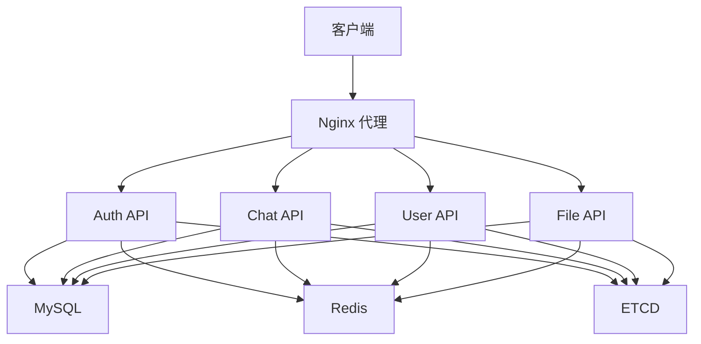

# 后端服务部署概述

海狸IM后端采用微服务架构，每个服务都可以独立部署和扩展。本文档介绍后端服务的整体部署架构和配置说明。

## 🏗️ 微服务架构

海狸IM后端包含以下核心微服务：

<div class="beaver-grid cols-2">
  <div class="beaver-card primary">
    <h4>🔐 认证服务 (Auth API)</h4>
    <p>用户认证和授权管理</p>
    <ul>
      <li>用户登录/注册</li>
      <li>JWT Token 管理</li>
      <li>权限验证</li>
    </ul>
  </div>

  <div class="beaver-card secondary">
    <h4>💬 聊天服务 (Chat API)</h4>
    <p>消息处理和聊天功能</p>
    <ul>
      <li>消息发送/接收</li>
      <li>消息历史记录</li>
      <li>群组聊天</li>
    </ul>
  </div>

  <div class="beaver-card primary">
    <h4>👤 用户服务 (User API)</h4>
    <p>用户信息管理</p>
    <ul>
      <li>用户资料管理</li>
      <li>好友关系管理</li>
      <li>用户搜索</li>
    </ul>
  </div>

  <div class="beaver-card secondary">
    <h4>📁 文件服务 (File API)</h4>
    <p>文件上传和管理</p>
    <ul>
      <li>文件上传/下载</li>
      <li>图片处理</li>
      <li>文件存储管理</li>
    </ul>
  </div>
</div>

## 📁 部署目录结构

```
/mnt/beaver/
├── auth_api/              # 认证服务
│   ├── docker-compose.yml
│   ├── configs/
│   └── logs/
├── chat_api/              # 聊天服务
│   ├── docker-compose.yml
│   ├── configs/
│   └── logs/
├── user_api/              # 用户服务
│   ├── docker-compose.yml
│   ├── configs/
│   └── logs/
└── file_api/              # 文件服务
    ├── docker-compose.yml
    ├── configs/
    └── logs/
```

## 🔧 服务依赖关系



## ⚙️ 环境配置

### 基础环境变量

所有后端服务都需要以下基础环境配置：

```bash
# 数据库配置
MYSQL_HOST=10.0.20.7
MYSQL_PORT=3306
MYSQL_USER=beaver
MYSQL_PASSWORD=beaver123
MYSQL_DATABASE=beaver_im

# Redis配置
REDIS_HOST=10.0.20.7
REDIS_PORT=6379
REDIS_PASSWORD=beaver123

# ETCD配置
ETCD_SERVER=http://10.0.20.7:1900
```

> **注意**: `10.0.20.7` 为服务器内网地址，请根据实际情况替换为您服务器的内网IP地址。

### 服务端口分配

| 服务 | 端口 | 说明 |
|------|------|------|
| Auth API | 8001 | 认证服务端口 |
| Chat API | 8002 | 聊天服务端口 |
| User API | 8003 | 用户服务端口 |
| File API | 8004 | 文件服务端口 |

## 🚀 部署顺序

1. **基础服务部署** - 确保 MySQL、Redis、ETCD 服务正常运行
2. **认证服务** - 优先部署 Auth API，其他服务依赖认证
3. **用户服务** - 部署 User API，提供用户管理功能
4. **聊天服务** - 部署 Chat API，提供消息功能
5. **文件服务** - 部署 File API，提供文件上传功能

## 📋 部署检查清单

- [ ] 基础服务（MySQL、Redis、ETCD）正常运行
- [ ] 网络连通性测试通过
- [ ] 数据库连接测试通过
- [ ] 各服务端口未被占用
- [ ] 配置文件正确设置
- [ ] 服务启动成功
- [ ] 健康检查通过

## 🔍 服务监控

### 健康检查

每个服务都提供健康检查接口：

```bash
# 检查服务状态
curl http://localhost:8001/health  # Auth API
curl http://localhost:8002/health  # Chat API
curl http://localhost:8003/health  # User API
curl http://localhost:8004/health  # File API
```

### 日志查看

```bash
# 查看服务日志
docker logs auth_api
docker logs chat_api
docker logs user_api
docker logs file_api
```

## 🆘 故障排查

### 常见问题

1. **服务无法启动**
   - 检查端口是否被占用
   - 检查配置文件是否正确
   - 检查依赖服务是否正常

2. **数据库连接失败**
   - 检查 MySQL 服务状态
   - 检查网络连通性
   - 检查数据库配置

3. **Redis 连接失败**
   - 检查 Redis 服务状态
   - 检查密码配置
   - 检查网络连通性

### 调试命令

```bash
# 检查容器状态
docker ps -a

# 进入容器调试
docker exec -it auth_api sh

# 查看服务日志
docker logs -f auth_api
```

## 📚 相关文档

- [认证服务部署](./auth_api.md)
- [聊天服务部署](./chat_api.md)
- [用户服务部署](./user_api.md)
- [文件服务部署](./file_api.md)

